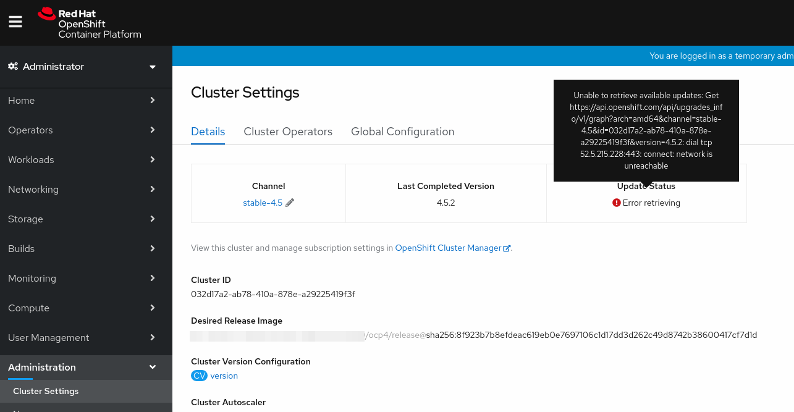
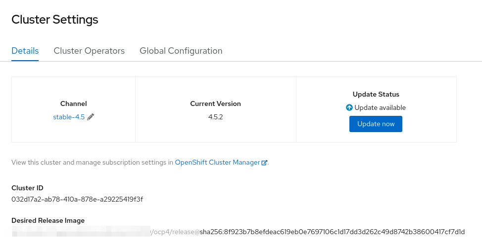
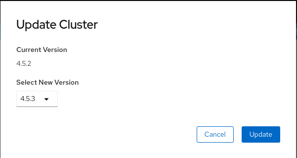
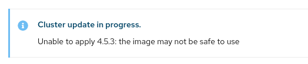
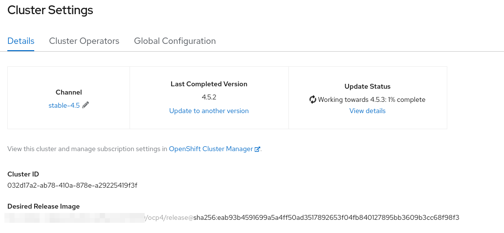

# Disconnected Cincinnati 

## Deploy Cincinnati Operator using OLM

> **NOTE:** When the Cincinnati Operator makes it to the **Red Hat Operators** Catalog, the procedure below won't be required. You will be able to deploy the operator from the in-cluster OperatorHub. 
You can follow [this doc](https://docs.openshift.com/container-platform/4.5/operators/olm-restricted-networks.html) to make the default catalogs available in a disconnected cluster.

1. Clone the operator-registry repo

    ~~~sh
    git clone https://github.com/operator-framework/operator-registry
    ~~~
2. Remove any existing manifest from the registry manifest folder

    ~~~sh
    rm -rf operator-registry/manifests/*
    ~~~
3. Clone the cincinnati-operator repo
    
    ~~~sh
    git clone https://github.com/openshift/cincinnati-operator
    ~~~
4. Copy the cincinnati package definition to the registry repo

    ~~~sh
    cp -pr cincinnati-operator/config/olm-catalog/updateservice-operator operator-registry/manifests/
    ~~~
5. Update the CSV to point to the local mirror instead of quay

    ~~~sh
    DISCONNECTED_REGISTRY="my-disconnected-registry.example.com:5000"
    sed -i "s|quay.io/updateservice/updateservice-operator:latest|${DISCONNECTED_REGISTRY}/updateservice/updateservice-operator:latest|g" operator-registry/manifests/updateservice-operator/1.0.0/updateservice-operator.v1.0.0.clusterserviceversion.yaml
    sed -i "s|quay.io/cincinnati/cincinnati:latest|${DISCONNECTED_REGISTRY}/cincinnati/cincinnati:latest|g" operator-registry/manifests/updateservice-operator/1.0.0/updateservice-operator.v1.0.0.clusterserviceversion.yaml
    ~~~
6. Build the catalog registry and push the image to the local registry

    ~~~sh
    sudo podman build -f operator-registry/upstream-example.Dockerfile -t ${DISCONNECTED_REGISTRY}/local-operators/updateservice-operator-registry:v1
    sudo podman push ${DISCONNECTED_REGISTRY}/local-operators/updateservice-operator-registry:v1 --authfile=/path/to/pull_secret.json
    ~~~
7. Mirror the cincinnati operand and update-service operator image to the local registry

    ~~~sh
    # Operator
    skopeo copy docker://quay.io/cincinnati/cincinnati-operator:latest docker://${DISCONNECTED_REGISTRY}/cincinnati/updateservice-operator:latest --authfile=/path/to/pull_secret.json
    # Cincinnati (get the tag from https://quay.io/repository/app-sre/cincinnati?tab=tags)
    skopeo copy docker://quay.io/app-sre/cincinnati:a8abb82 docker://${DISCONNECTED_REGISTRY}/cincinnati/cincinnati:latest --authfile=/path/to/pull_secret.json
    ## Check Images
    skopeo inspect docker://${DISCONNECTED_REGISTRY}/updateservice/updateservice-operator:latest --authfile=/path/to/pull_secret.json
    skopeo inspect docker://${DISCONNECTED_REGISTRY}/cincinnati/cincinnati:latest --authfile=/path/to/pull_secret.json
    ~~~
8. Create the CatalogSource

    ~~~sh
    cat <<EOF | oc -n openshift-marketplace create -f -
    kind: CatalogSource
    apiVersion: operators.coreos.com/v1alpha1
    metadata:
      name: updateservice-catalog
    spec:
      sourceType: grpc
      displayName: Update Service Operator
      publisher: Solutions Engineering
      image: ${DISCONNECTED_REGISTRY}/local-operators/updateservice-operator-registry:v1
    EOF
    ~~~
9. Configure the Registry Certificate as trusted for cincinnati (Certificate to use in our env: /opt/registry/certs/domain.crt ) (docs here https://github.com/openshift/cincinnati-operator/blob/master/docs/external-registry-ca.md)

    ~~~sh
    cat <<EOF | oc -n openshift-config create -f -
    apiVersion: v1
    kind: ConfigMap
    metadata:
      name: trusted-ca
    data:
      cincinnati-registry: |
        -----BEGIN CERTIFICATE-----
        MIIGOzCCBCOgAwIBAgIUC/DKvLC9UP92cZ4SMWHWs0F2oI0wDQYJKoZIhvcNAQEL
        BQAwgawxCzAJBgNVBAYTAlVTMRYwFAYDVQQIDA1NYXNzYWNodXNldHRzMREwDwYD
        VQQHDAhXZXN0Zm9yZDEPMA0GA1UECgwGUmVkSGF0MQ0wCwYDVQQLDARNR01UMS4w
        LAYDVQQDDCVibS1jbHVzdGVyLTEtaHlwZXIuZTJlLmJvcy5yZWRoYXQuY29tMSIw
        IAYJKoZIhvcNAQkBFhNqb2huLmRvZUByZWRoYXQuY29tMB4XDTIwMDMxMDE1MDAz
        N1oXDTMwMDMwODE1MDAzN1owgawxCzAJBgNVBAYTAlVTMRYwFAYDVQQIDA1NYXNz
        YWNodXNldHRzMREwDwYDVQQHDAhXZXN0Zm9yZDEPMA0GA1UECgwGUmVkSGF0MQ0w
        CwYDVQQLDARNR01UMS4wLAYDVQQDDCVibS1jbHVzdGVyLTEtaHlwZXIuZTJlLmJv
        cy5yZWRoYXQuY29tMSIwIAYJKoZIhvcNAQkBFhNqb2huLmRvZUByZWRoYXQuY29t
        MIICIjANBgkqhkiG9w0BAQEFAAOCAg8AMIICCgKCAgEAvhV4or9YcBwlozKD/oXx
        dOBaUAbA0nKteXt3Yf5xIp39K548KveG42vsFzpZfg18mRFWcik9YlSZm0sV4UQ9
        Vt+PFzTwIobD2lJUjJqGdCmLM1jnX1G6D+wo3xcPqZtkxVmLiSyqnuNjXpmNROOd
        SA7Ff9KQaQSP7gvNdfDJuhS1KvMomH4kTmOcJhJxqbT9Wh76Lv4YiIJmxuNEmFaf
        mPkehJtsiVr7i4fLtYG76ZkAnaTFD2qb/b55z1bj3EyARA+DsI+FgZz/QUUlHogn
        V33KXM7w33fzqDGWq/2ENWjeKgfZxtgjYeTEu+BTaiTdTErrqI6sz4bTKA2kvCyY
        e0WT6QaMTrogD5lnn/bmbK1aLQ3eG9aKwfSskW6TJCtWCSoMxOuC5orufYKmKNW0
        QzjF6HSnoOVNFT//aZkgV1QdDxLA+1L3onDdSz9Nen0YJHEVXqfFbOOBVP+aii6M
        I2BvQP8IlNBLVBbsqlUn9CqwJzEeSh28+PLzzR/VAgrAUD5DmEWIsoZsp4YuFqtz
        Yq2xSdroK3VmBaGwDESQbblFB2mSwpVBZk4tTWsGMT0wbqrXamzEcEivGk6yHjoO
        /9saTV4ETaDlTIugCwnhk1CwWROi/8Ey1LIobDGUYvY7CoRv3YCF75ehRrrrMLLb
        TS0ajkftO8m/8/W3V3tMttUCAwEAEaNTMFEwHQYDVR0OBBYEFKN3c3lVDVhOqyml
        Yh93EoV+eX/6MB8GA1UdIwQYMBaAFKN3c3lVDVhOqymlYh93EoV+eX/6MA8GA1Ud
        EwEB/wQFMAMBAf8wDQYJKoZIhvcNAQELBQADggIBALd8eZOinsgrZsOYCUJGVXu7
        zazSa1ZPEAzGpxky6iJzN8d8Zb5lerSdjm8DOrrjKqL1KZmDUykVBmUymo3Op4WC
        AMAuyAlBKbvu/CgUcm5SnqInB80y5WwOJgYMGsHMn3zVBdOmiUVUVNbhxD4alE2e
        Q41aV4pMa6cEX/5+VvGuG3QeEJZp8GmLCnVETycwEPTD1OvyQa5Q4GTW0KyzM0bS
        ljjBvEe0ETvJ6jBiQvbK/PwcU8U4b47L7YaPNzrmB1WW3yFOlm691bD6ZvR1SKL8
        hkjQuXy0i5zTkdrmRby0JTmTih0V7GblW4qxVxhqISQZRSWHSN4a3nBH7SNMhIxa
        VGS1f4kTyYsijTtZvW7/gu4KXqM23DW8rI9iN8ZHw3OAfHZ0P0mSipt2956xPeBy
        aH9RpIMx0vp1Wbj70dkzWVhe7Id3438sfbx1R4PTDWq6K9I4Ac9uxGVK8boKhUKw
        1cyxooUDa/9Y2UhP0fZmbYIq2q9m9XUNwLH34Ia85ARUTeO8hUlk+rYn33DBjKEy
        D43pg+j5vsq4/fvdpTtAmHi11Sw7bhdKoZB8MHVqmzICtgukPcjzrufmLqTwXjGo
        kxojr22idqEH346ForYZ9sn7sjY/KMBfATna7/sbLdoRqhgROcJWT97C0FuEp2ca
        xz5prLvKtVTltF2DKKb0
        -----END CERTIFICATE-----
    EOF
    ~~~
10. Patch the Cluster image configuration

    ~~~sh
    oc patch image.config.openshift.io cluster -p '{"spec":{"additionalTrustedCA":{"name":"trusted-ca"}}}' --type merge
    ~~~
11. Deploy the Update Service Operator

    ~~~sh
    NAMESPACE=example-namespace
    oc create ns $NAMESPACE
    cat <<EOF | oc -n $NAMESPACE create -f - 
    apiVersion: operators.coreos.com/v1alpha1
    kind: Subscription
    metadata:
      name: updateservice-subscription
    spec:
      channel: alpha
      name: updateservice-operator-package
      installPlanApproval: Automatic
      source: updateservice-catalog
      sourceNamespace: openshift-marketplace
    ---
    apiVersion: operators.coreos.com/v1
    kind: OperatorGroup
    metadata:
      name: updateservice-operatorgroup
    spec:
      targetNamespaces:
      - $NAMESPACE
    EOF
    ~~~

## Create the Graph Data for Cincinnati

By default cluster is configured on the channel `stable-4.5`

We deployed 4.5.2 release, and we want the cluster to be updated to release 4.5.3

We need to create the graph data for that.

1. Clone the graph data repository

    ~~~sh
    git clone https://github.com/openshift/cincinnati-graph-data
    ~~~
2. Since we are using stable-4.5 channel, let's add the releases to the graph data

    ~~~sh
    cat <<EOF > cincinnati-graph-data/channels/stable-4.5.yaml 
    name: stable-4.5
    versions:
    
    - 4.5.2

    - 4.5.3
    EOF
    ~~~
3. Create a tarball of the repository folder

    ~~~sh
    tar cvfz cincinnati-graph-data.tar.gz cincinnati-graph-data
    ~~~
4. Build the graph data init container (doc https://github.com/openshift/cincinnati-operator/blob/master/docs/graph-data-init-container.md)

    ~~~sh
    cp /path/to/cincinnati-graph-data.tar.gz cincinnati-operator/dev/
   
    cat <<EOF > cincinnati-operator/dev/Dockerfile
    FROM registry.access.redhat.com/ubi8/ubi:8.1
    COPY cincinnati-graph-data.tar.gz /tmp/
    RUN mkdir -p /var/lib/cincinnati/graph-data/
    CMD exec /bin/bash -c "tar xvzf /tmp/cincinnati-graph-data.tar.gz -C /var/lib/cincinnati/graph-data/ --strip-components=1"
    EOF
   
    sudo podman build -f cincinnati-operator/dev/Dockerfile -t ${DISCONNECTED_REGISTRY}/cincinnati/cincinnati-graph-data-container:latest
    sudo podman push ${DISCONNECTED_REGISTRY}/cincinnati/cincinnati-graph-data-container:latest --authfile=/path/to/pull_secret.json
    ~~~

## Deploy Cincinnati instance

The Cincinnati Operator will take care of configuring the Cincinnati instance with authentication if a pull secret is detected on the `openshift-config` namespace. [Feature PR](https://github.com/openshift/cincinnati-operator/pull/53).

You might want to review the documentation around disconnected registries to learn about mirroring OpenShift Releases. Docs [here](https://gitlab.cee.redhat.com/sysdeseng/pit-hybrid/-/blob/master/docs/disconnected-registries/readme.md).

1. If you have you mirrored your OpenShift Release Image and Release Content with an identical path, Cincinnati's Graph Builder will take more memory than allowed by the Deployment configuration and the pod will be OOMKilled. If this is your case you can copy the release image to a different namespace in your registry.

    > **NOTE**: The command below is not always required, read the problem description carefully
    ~~~sh
    skopeo copy docker://${DISCONNECTED_REGISTRY}/ocp4:4.5.2-x86_64 docker://${DISCONNECTED_REGISTRY}/openshiftreleases:4.5.2-x86_64 --authfile=/path/to/pull_secret.json
    skopeo copy docker://${DISCONNECTED_REGISTRY}/ocp5:4.5.3-x86_64 docker://${DISCONNECTED_REGISTRY}/openshiftreleases:4.5.3-x86_64 --authfile=/path/to/pull_secret.json
    ~~~

2. Create the Cincinnati CR

    * Option 1: OpenShift Release Image and Release Content in different paths (release under ocp4/release, content under ocp4)

        ~~~sh
        cat <<EOF | oc -n "${NAMESPACE}" create -f -
        apiVersion: updateservice.operator.openshift.io/v1
        kind: UpdateService
        metadata:
          name: example-name
        spec:
          replicas: 1
          releases: "${DISCONNECTED_REGISTRY}/ocp4/release"
          graphDataImage: "${DISCONNECTED_REGISTRY}/cincinnati/cincinnati-graph-data-container:latest"
        EOF
        ~~~
    * Option 2: OpenShift Release Image and Release Content in the same path (ocp4), release image copied to a new namespace in the registry (openshiftreleases)

        ~~~sh
        cat <<EOF | oc -n "${NAMESPACE}" create -f -
        apiVersion: cincinnati.openshift.io/v1beta1
        kind: Cincinnati
        metadata:
          name: example-name
        spec:
          replicas: 1
          registry: "${DISCONNECTED_REGISTRY}/openshiftreleases"
          graphDataImage: "${DISCONNECTED_REGISTRY}/cincinnati/cincinnati-graph-data-container:latest"
        EOF
        ~~~
3. Wait for a public route, polling until:

    ~~~sh
    POLICY_ENGINE_GRAPH_URI="$(oc -n "${NAMESPACE}" get -o jsonpath='{.status.policyEngineURI}/api/upgrades_info/v1/graph}{"\n"}' cincinnati example-name)"
    ~~~

    gives a full URI.

4. At this point we have Cincinnati working locally, but our cluster is still pointing to the public Cincinnati instance as we can see in the image below

    
5. Patch the ClusterVersion to use our Cincinnati instance rather than the public one

    ~~~sh
    PATCH="{\"spec\":{\"upstream\":\"${POLICY_ENGINE_GRAPH_URI}\"}}"
    oc patch clusterversion version -p $PATCH --type merge
    ~~~
6. Now that our cluster points to the local Cincinnati instance we will see the update available

    
7. We can go ahead and update the cluster, but we will get a warning since the image is not signed yet

    

    
8. We can force the update using the CLI

    ~~~sh
    oc adm upgrade --to-latest --allow-upgrade-with-warnings --force
    ~~~
9. The Update will start then

    
10. The cluster update will finish eventually

# Useful tools

## Print the graph

You can print the graph for a specific channel in your Cincinnati instance using the commands below

~~~sh
sudo dnf install -y graphviz
curl -O https://raw.githubusercontent.com/openshift/cincinnati/master/hack/graph.sh
chmod +x graph.sh
curl --header 'Accept:application/json' "${POLICY_ENGINE_GRAPH_URI}?channel=stable-4.5" | ./graph.sh | dot -Tpng > graph.png
~~~

## Mirror the release images

~~~sh
export UPSTREAM_REGISTRY='quay.io'
export PRODUCT_REPO='openshift-release-dev'
export RELEASE_NAME='ocp-release'
export OCP_RELEASE='4.5.2-x86_64'
export LOCAL_REGISTRY='my-disconnected-registry.example.com:5000'
export LOCAL_SECRET_JSON='/path/to/pull_secret.json'

oc adm -a ${LOCAL_SECRET_JSON} release mirror \
--from=${UPSTREAM_REGISTRY}/${PRODUCT_REPO}/${RELEASE_NAME}:${OCP_RELEASE} \
--to=${LOCAL_REGISTRY}/ocp4 \
--to-release-image=${LOCAL_REGISTRY}/ocp4/release:${OCP_RELEASE}

export OCP_RELEASE='4.5.3-x86_64'

oc adm -a ${LOCAL_SECRET_JSON} release mirror \
--from=${UPSTREAM_REGISTRY}/${PRODUCT_REPO}/${RELEASE_NAME}:${OCP_RELEASE} \
--to=${LOCAL_REGISTRY}/ocp4 \
--to-release-image=${LOCAL_REGISTRY}/ocp4/release:${OCP_RELEASE}
~~~

# Useful docs

* https://github.com/openshift/cincinnati/blob/master/docs/user/running-cincinnati.md
* https://github.com/openshift/cincinnati-operator/blob/master/docs/graph-data-init-container.md
* https://github.com/openshift/cincinnati-operator/blob/master/docs/external-registry-ca.md
* Repositories
  * https://github.com/openshift/cincinnati-graph-data/
  * https://github.com/openshift/cincinnati-operator/
  * https://github.com/openshift/cincinnati
